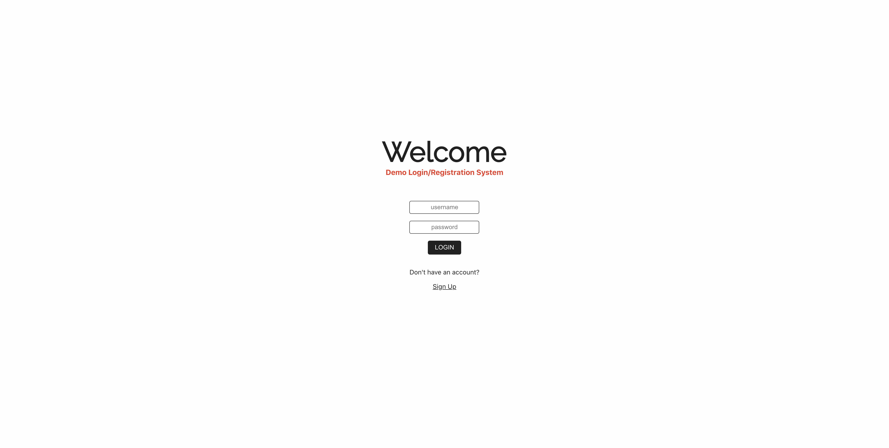
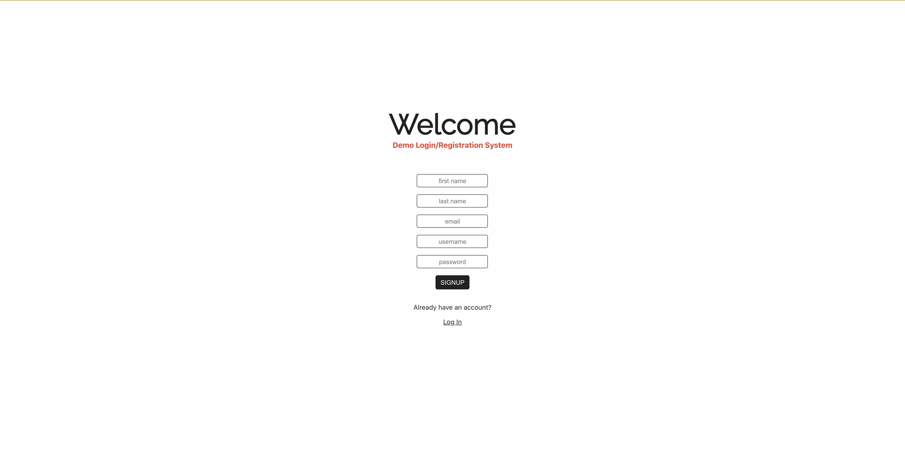

# Simple Login/Registration App Demonstration

* **Developer Name: Michelle Colacion Francisco**

* Using ReactJS, NodeJS, Express, GraphQL, Prisma, & PostgreSQL

* Created and submitted in fulfillment of the technical challenge for the Web Developer Position at StageWood Consortium, Inc.

<br>

## Quick Links

[Client/Front-End GitHub Repo](https://github.com/mischkiey/auth-graphql-client.git)

[API/Back-End GitHub Repo](https://github.com/mischkiey/auth-graphql-api.git)

<br>

## Client Installation

1. `git clone https://github.com/mischkiey/auth-graphql-client.git NEW-PROJECT-NAME` to clone the repository to your local machine

2. `cd` into the cloned repository

3. `npm i` to install node dependencies

4. `mv example.env .env` to move the example environment file to .env that will be ignored by git and read by React. Modify REACT_APP_TOKEN_KEY as needed.

5. `npm start` to run the application in development mode

<br>

## API Installation

1. `git clone https://github.com/mischkiey/auth-graphql-api.git NEW-PROJECT-NAME` to clone the repository to your local machine

2. `cd` into the cloned repository

3. `npm i` to install node dependencies

4. `mv example.env .env` to move the example environment file to .env that will be ignored by git and read by the express server. Modify the variables as needed.

5. `createdb -U [username] [dbname]` to create db using command line

6. `npm run migrate` to save prisma migration and setup/update _Migration table in your db

7. `npm start` to run the application or `npm run dev` to run nodemon for the application

<br>

## Client App Screenshots

1. Login Page



2. Signup Page



3. Mock Dashboard


<br>

## GraphQL Schema Documentation

```javascript
type Mutation {
    login(username: String!, password: String!): AuthPayload
    signup(input: SignupInput): AuthPayload
  }

  type AuthPayload {
    token: String
    user: User
  }

  type User  {
    id: ID!
    firstName: String!
    lastName: String!
    email: String!
    username: String!
  }

  input SignupInput {
    firstName: String!
    lastName: String!
    email: String!
    username: String!
    password: String!
  }
```

<br>

## Tech Stack

1. Front-End
    * React

2. Back-End
    * NodeJS
    * Express
    * GraphQL
    * Prisma

3. DBMS
    * PostgreSQL